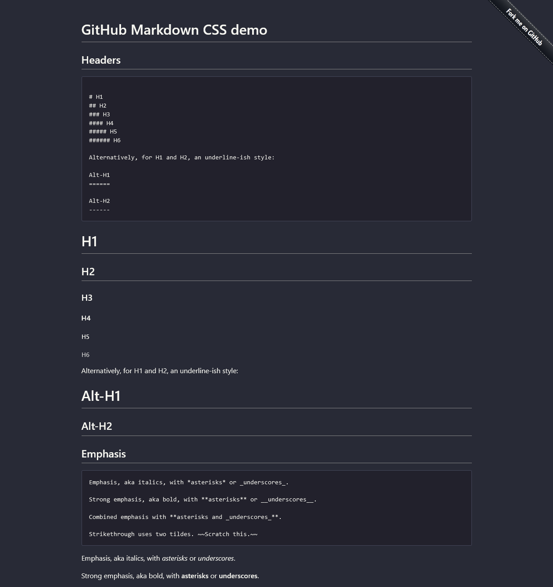

# github-markdown-dark-css

Forked from [sindresorhus/github-markdown-css](https://github.com/sindresorhus/github-markdown-css) by Mr Dk.

2019/07 Nanjing, Jiangsu, China

---

## About

Modified version based on the original repository, to build a **dark theme** for my blog.

## Install

```bash
npm install --save duckling-markdown-css
```

## Usage

```html
<!doctype html>
<html>
  <head>
    <link rel="stylesheet" href="github-markdown-dark.css">
  </head>
  <body>
    <article class="markdown-body-dark"></article>
  </body>
</html>
```

## Demo



---

